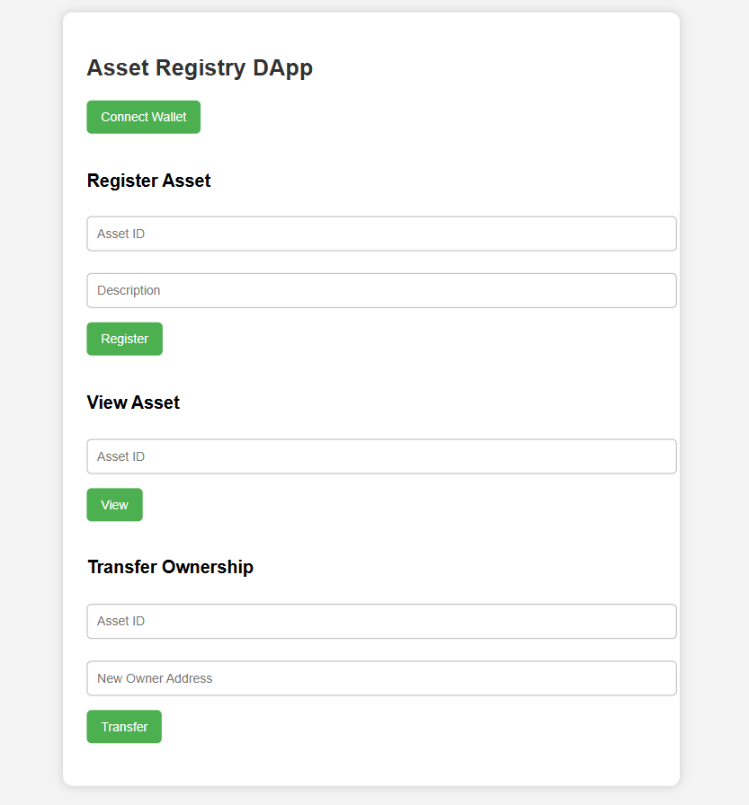

# Asset-registry-dApp

This project is a decentralized application (dApp) that allows users to
**register assets on the Ethereum blockchain** using a minimal smart
contract and a simple HTML/JavaScript frontend.

It consists of two main parts:

1.  **A Smart Contract (`AssetRegistry.sol`)**\
    The backend logic that stores asset ownership on the blockchain.

2.  **A dApp Frontend (`index.html`)**\
    A lightweight webpage that allows users to connect their wallets and
    interact with the contract (register an asset + view an asset
    owner).

------------------------------------------------------------------------

## Contract Deployment

**Network:** Sepolia\
**Contract Address:** *your_contract_address_here*\
You can view it on Etherscan:\
`https://sepolia.etherscan.io/address/your_contract_address_here`

------------------------------------------------------------------------

## How It Works

The dApp is powered by the **AssetRegistry.sol** smart contract, which
supports:

1.  **Register Asset**\
    Users call `registerAsset(id)` to register an asset.\
    Each asset ID can be registered only once.

2.  **Ownership Tracking**\
    The contract maintains ownership using a Solidity mapping:

        mapping(uint256 => address) public assetOwners;

3.  **Read Ownership**\
    Anyone can call `getOwner(id)` to check who owns a specific asset.

4.  **Simple & Minimal**\
    No tokens, no NFTs --- just a clean registry stored directly
    on-chain.

------------------------------------------------------------------------

## File Structure

    /project-folder
    │── AssetRegistry.sol     # Smart contract
    │── index.html            # Frontend UI
    │── README.md             # This file

------------------------------------------------------------------------

## Smart Contract (AssetRegistry.sol)

The smart contract includes:

-   A mapping to store asset ownership\
-   `registerAsset(id)` function\
-   `getOwner(id)` function\
-   A restriction so no one can register the same asset twice

------------------------------------------------------------------------

## Frontend (index.html)

The frontend allows the user to:

-   Connect their MetaMask wallet\
-   Register an asset by entering an ID\
-   View the owner of a registered asset\
-   Interact with the contract using **ethers.js**

No backend needed --- everything runs in the browser.

------------------------------------------------------------------------

## How to Run Locally

### Clone the repository

    git clone https://github.com/yourname/yourrepo.git
    cd yourrepo

### Deploy the contract (if not deployed)

Deploy `AssetRegistry.sol` on Sepolia and update your `index.html`:

``` js
const contractAddress = "YOUR_DEPLOYED_CONTRACT_ADDRESS";
```

### Open the frontend

Open `index.html` in your browser (MetaMask required).

------------------------------------------------------------------------

## Features Demo

### Register an Asset

Enter an ID → Click **Register** → MetaMask transaction pops up.

### Check Asset Owner

Enter an ID → Click **Check Owner** → Owner address displayed.

------------------------------------------------------------------------

## Technologies Used

-   Solidity\
-   Ethers.js\
-   MetaMask\
-   HTML + JavaScript

------------------------------------------------------------------------
## 📸 Screenshot of the DApp


